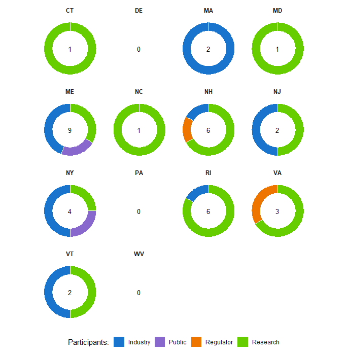

## Thank you for participating in my poster during NACE 2026. A total of 37 people participated from across 11 states. 
Below are the results:

## Most Common Challenges

## Challenges by Sector

## Challenges by State

